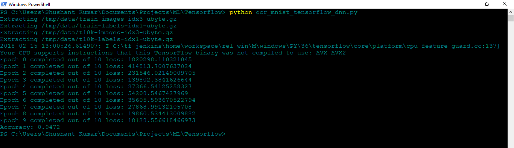
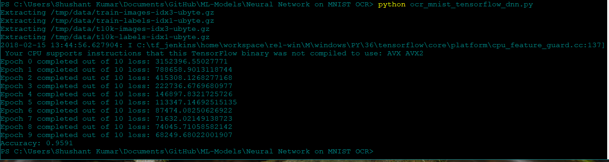
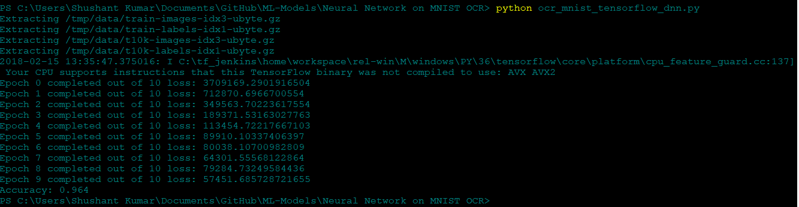

# Deep Neural Network on MNIST OCR dataset

This is a Neural Network Model which takes dataset from MNIST of around 60K images of Optical Characters (0-9)<br>
The library used is tensorflow<br>

To run this: 

    ```
        python ocr_mnist_tensorflow_dnn.py
    ``` 

I have used 3 hidden layers for this neural network. Number of Epoch cycles are 10.

I tried with three different sets of number of nodes in each hidden layer to test the accuracy :

* Hidden Layer 1: 500	|	Hidden Layer 2: 500		|	Hidden Layer 3: 500		|	Accuracy : 94.72%



* Hidden Layer 1: 500	|	Hidden Layer 2: 1000		|	Hidden Layer 3: 1500		|	Accuracy : 95.91%



* Hidden Layer 1: 1500	|	Hidden Layer 2: 1000		|	Hidden Layer 3: 500		|	Accuracy : 96.4%


